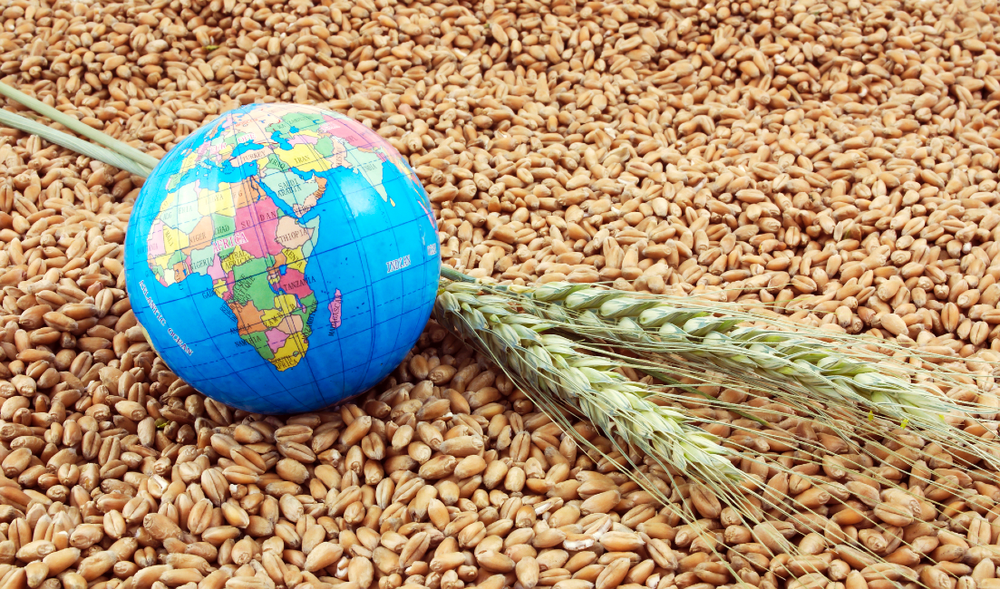

# International Food Security

#### -- Project Status: [Completed]

## Project Intro/Objective
**Food security** is an important component of international aid programs targeting hunger and malnutrition, and still poses major challenges in vulnerable populations and countries (USAID, August 2023). **Climate change** is threatening these efforts and improvements with wide-ranging consequences (Gregory et al., 2005). For example, more extreme weather events like hurricanes or floods become more probable and frequent, potentially destroying harvests (Drijfhou, 2015). **Climate-induced food insecurity** can contribute to forced migration and conflict, as communities may be displaced in search of better conditions or resources (McMichael, 2014). Especially **higher temperatures** as part of climate change have a big impact on food security (Redden et al., 2014). They can **endanger crop yields** by several mechanisms. Firstly, they can reduce the duration of crop growth, and affect the flowering and pollination, potentially leading to less crop yields (Ritchie, & Nesmith, 1991). Second, increased evaporation due to higher temperatures together with altered rainfall patterns can lead to water scarcity, limiting agricultural productivity and leading to crop failures (Mancosu et al., 2015). Third, higher temperatures facilitate pests and diseases that can destroy crops (Dhawanet al, 2013). In turn, less crops are also affecting fodder availability for live stock, thus also threatening food security (Thornton et al., 2007).

### Contributing Members
* Annalena Kreischer
* Ansam Zedan

### Methods Used
* Inferential Statistics
* Machine Learning
* Data Visualization
* Predictive Modeling

### Technologies
* R
* Shinnyapp
* ggplot2
* tidyr    
* forecast  
* tseries   
* lubridate
* corrplot
* tidyverse
* car
* randomForest
* lattice
* gridExtra
* rnaturalearth
* rnaturalearthdata
* grid
* patchwork
* corrr
* pastecs
